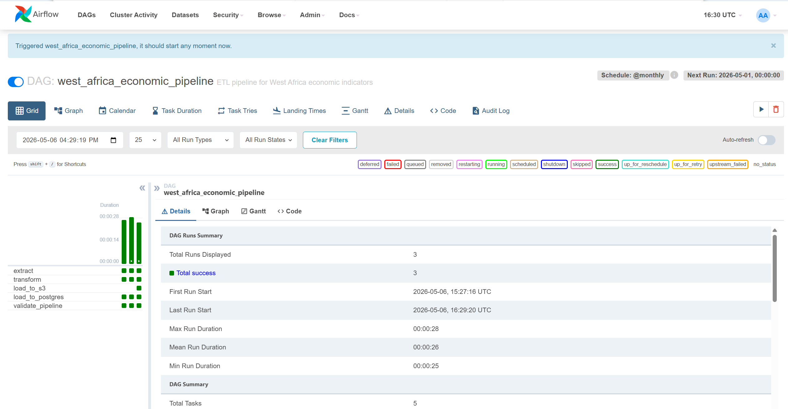
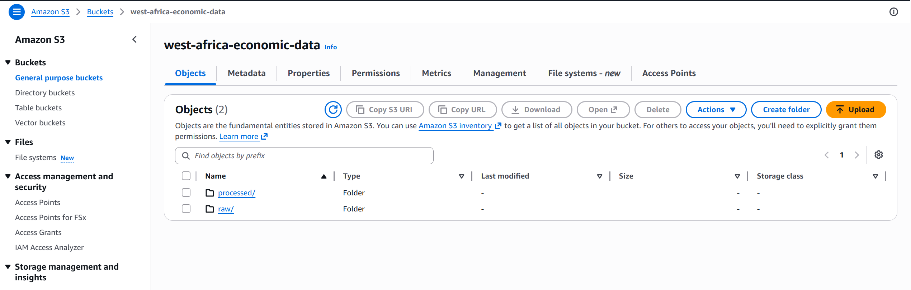
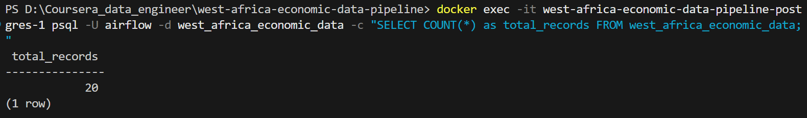

# West Africa Economic Data Pipeline

A production-grade ETL (Extract, Transform, Load) platform that automates the collection, processing, and warehousing of key economic indicators for 10 West African countries. Built with Apache Airflow, PostgreSQL, and AWS S3, this pipeline demonstrates enterprise-level data engineering practices including orchestration, error handling, data validation, and automated monitoring.

## 📋 Table of Contents
- [Overview](#-overview)
- [Architecture](#️-architecture)
- [Tech Stack](#️-tech-stack)
- [Features](#-features)
- [Installation](#-installation)
- [Usage](#-usage)
- [Data Schema](#-data-schema)
- [Project Structure](#-project-structure)
- [Pipeline Workflows](#-pipeline-workflows)
- [Performance & Optimization](#-performance--optimization)
- [Error Handling & Monitoring](#️-error-handling--monitoring)
- [Testing](#-testing)
- [Future Enhancements](#-future-enhancements)
- [Contributing](#-contributing)
- [License](#-license)
- [Author](#️-author)
- [Acknowledgments](#-acknowledgments)

## 📊 Overview

This project ingests economic data from the **World Bank API** for 10 West African nations, applies rigorous data quality checks and transformations, and persists the results to both PostgreSQL (OLAP warehouse) and AWS S3 (data lake). The pipeline is fully orchestrated via Apache Airflow with retry logic, comprehensive logging, and data validation at multiple stages.

**Key Metrics:**
- **10 Countries**: Senegal, Nigeria, Ghana, Côte d'Ivoire, Mali, Burkina Faso, Guinea, Togo, Benin, Mauritania
- **8 Economic Indicators**: GDP (current USD), Population, Inflation Rate, Unemployment Rate, Internet Users %, GDP per Capita, Digital Adoption Score, Economic Health Score
- **Data Quality**: 13 dimensions tracked (ingestion timestamp, quality flags, validation status)
- **Frequency**: Monthly automated runs via cron schedule
- **Latency**: <5 minutes end-to-end (extract to warehouse)

## 🏗️ Architecture

```
┌─────────────────────────────────────────────────────────────────────┐
│                    ORCHESTRATION LAYER                              │
│                   Apache Airflow (Scheduler)                        │
│                   - DAG: west_africa_economic_pipeline              │
│                   - Schedule: @monthly                              │
│                   - Executor: LocalExecutor                         │
└─────────────────┬───────────────────────────────────────────────────┘
                  │
        ┌─────────┴──────────┬────────────────┐
        │                    │                │
        ▼                    ▼                ▼
┌──────────────┐  ┌──────────────┐  ┌──────────────┐
│   EXTRACT    │  │  TRANSFORM   │  │    LOAD      │
│              │  │              │  │              │
│ World Bank   │  │ Data         │  │ PostgreSQL   │
│ API (2-3     │  │ Cleaning &   │  │ (OLAP)       │
│ years data)  │  │ Validation   │  │              │
│              │  │ (20 records) │  │ AWS S3       │
└──────────────┘  └──────────────┘  │ (Data Lake)  │
                                    │              │
                                    └──────────────┘
                                              │
                                              ▼
                                      ┌──────────────┐
                                      │  VALIDATE    │
                                      │              │
                                      │ Row counts   │
                                      │ Schema check │
                                      │ Quality flag │
                                      └──────────────┘
```

### Pipeline Stages

1. **EXTRACT** (Task: `extract`)
   - Connects to World Bank API via requests library
   - Retrieves 5 economic indicators (GDP, Population, Inflation, Unemployment, Internet Users) for each country
   - Handles API rate-limiting and retries with exponential backoff
   - Output: 20 records (10 countries × 2 years: 2019-2020)
   - Format: Pandas DataFrame → JSON (XCom)

2. **TRANSFORM** (Task: `transform`)
   - Data cleaning: handles null values, type conversions
   - Feature engineering: derives GDP per capita, digital adoption score, economic health composite
   - Validation: schema validation, range checks, outlier detection
   - Data quality scoring: assigns HIGH/MEDIUM/LOW flag
   - Output: 20 clean, enriched records
   - Format: Pandas DataFrame → JSON (XCom)

3. **LOAD** (Tasks: `load_to_postgres`, `load_to_s3`)
   - **PostgreSQL**: 
     - Temporary table staging (atomic upsert pattern)
     - ON CONFLICT handling for idempotency
     - Transactional safety with SQLAlchemy context managers
   - **AWS S3** (optional):
     - Raw data lake: `/raw/extract/`
     - Processed layer: `/processed/transformed/`
     - Format: Parquet + JSON for interoperability

4. **VALIDATE** (Task: `validate_pipeline`)
   - Verifies row counts (expect exactly 10 countries)
   - Confirms zero failed records
   - Checks ingestion timestamp freshness
   - Logs aggregated metrics to monitoring system

## 🛠️ Tech Stack

| Component | Technology | Version | Purpose |
|-----------|-----------|---------|---------|
| **Orchestration** | Apache Airflow | 2.7.0 | DAG scheduling, retry logic, monitoring |
| **Language** | Python | 3.8+ | Data processing, ETL logic |
| **Data Processing** | Pandas | 1.3+ | DataFrames, transformations |
| **API Client** | Requests | 2.28+ | HTTP calls to World Bank API |
| **Database** | PostgreSQL | 13 | OLAP warehouse |
| **ORM** | SQLAlchemy | 1.4 | Database abstraction layer |
| **Storage** | AWS S3 | - | Data lake (optional) |
| **Containerization** | Docker | 20.10+ | Isolated environments |
| **Container Orchestration** | Docker Compose | - | Multi-container management |
| **Version Control** | Git | - | Code management |

## ✨ Features

✅ **Production-Grade Orchestration**
- Dag-based task dependencies with clear data lineage
- Automated retry logic (3 retries × 5-min intervals on failure)
- XCom for inter-task data passing (20KB+ payloads)
- Comprehensive audit logging to files and Airflow UI

✅ **Data Quality & Validation**
- Multi-stage validation pipeline (extract, transform, load)
- Schema enforcement with explicit type casting
- NULL handling with forward-fill/drop strategies
- Data quality scoring (HIGH/MEDIUM/LOW flags)
- Duplicate detection via UNIQUE constraints

✅ **Scalability & Performance**
- Chunked database inserts (500-row batches to prevent timeouts)
- Temporary table staging for atomic upserts
- Parameterized queries (SQLAlchemy prepared statements)
- Efficient JSON serialization via Pandas/PyArrow

✅ **Error Handling & Observability**
- Try-catch blocks with detailed exception logging
- Airflow task monitoring via web UI
- PostgreSQL query result verification
- XCom data type validation before loading

✅ **Infrastructure as Code**
- Docker Compose orchestration (4 services)
- Environment variable configuration
- SQL migration scripts
- Python dependency pinning (requirements.txt)

✅ **Data Lake with AWS S3** 
- Dual-destination architecture: PostgreSQL + S3
- Raw layer (CSV): full data provenance
- Processed layer (Parquet): optimized for analytics
- Temporal partitioning (YYYY/MM/DD/HHMMSS) for efficient querying
- Queryable via AWS Athena SQL

## 🚀 Installation

### Prerequisites
- Docker & Docker Compose (v20.10+)
- Python 3.8+ (for local development)
- PostgreSQL 13+ (already in Docker)
- Git

### Step 1: Clone Repository
```bash
git clone https://github.com/bachir00/west-africa-economic-data-pipeline.git
cd west-africa-economic-data-pipeline
```

### Step 2: Configure Environment
```bash
# Copy environment template
cp .env.example .env

# Add AWS credentials (optional, for S3 loading)
# AWS_ACCESS_KEY_ID=your_key
# AWS_SECRET_ACCESS_KEY=your_secret
# AWS_DEFAULT_REGION=us-east-1
# S3_BUCKET=your-bucket-name
```

### Step 3: Start Services
```bash
# Build and start all containers
docker-compose up -d

# Wait for services to initialize (30 seconds)
sleep 30

# Verify services are healthy
docker-compose ps

# Expected output:
# postgres              - healthy
# airflow-init          - completed
# airflow-webserver     - running (0.0.0.0:8080)
# airflow-scheduler     - running
```

### Step 4: Access Airflow UI
- **URL**: http://localhost:8080
- **Username**: admin
- **Password**: admin

### Step 5: Configure AWS S3 (Optional)

To enable data lake storage in AWS S3:

1. **Create AWS Account & S3 Bucket** - Follow [AWS_SETUP.md](AWS_SETUP.md) for complete guide
2. **Get IAM Credentials** - Create access keys for Airflow
3. **Update .env file:**
   ```bash
   AWS_ACCESS_KEY_ID=your_access_key
   AWS_SECRET_ACCESS_KEY=your_secret_key
   AWS_DEFAULT_REGION=us-east-1
   S3_BUCKET=west-africa-economic-data
   ```
4. **Restart Docker:**
   ```bash
   docker-compose down
   docker-compose up -d
   ```

For detailed AWS setup instructions, see [AWS_SETUP.md](AWS_SETUP.md) →

## 📖 Usage

### Trigger a DAG Run

1. Navigate to Airflow UI: http://localhost:8080
2. Find DAG: `west_africa_economic_pipeline`
3. Click the **Play (▶️)** button to trigger
4. Monitor in the **Graph View** as tasks execute sequentially

### Manual Task Execution (CLI)
```bash
# Execute a single task
docker-compose exec airflow-scheduler airflow tasks run \
  west_africa_economic_pipeline extract 2026-05-06

# List all DAGs
docker-compose exec airflow-scheduler airflow dags list

# Get DAG details
docker-compose exec airflow-scheduler airflow dags info west_africa_economic_pipeline
```

### View Logs
```bash
# Scheduler logs
docker-compose logs -f airflow-scheduler

# Webserver logs  
docker-compose logs -f airflow-webserver

# PostgreSQL logs
docker-compose logs -f postgres
```

### Query Results
```bash
# Connect to PostgreSQL
docker-compose exec postgres psql -U airflow -d west_africa_economic_data

# Example queries
SELECT * FROM west_africa_economic_data LIMIT 5;
SELECT country_name, year, gdp_current_usd FROM west_africa_economic_data;
SELECT COUNT(*) as record_count, COUNT(DISTINCT country_code) as countries 
FROM west_africa_economic_data;
```

## 📊 Data Schema

### Table: `west_africa_economic_data`

| Column | Type | Constraint | Description |
|--------|------|-----------|-------------|
| `id` | SERIAL | PRIMARY KEY | Auto-incrementing identifier |
| `country_code` | VARCHAR(3) | NOT NULL | ISO 3-letter country code |
| `country_name` | VARCHAR(100) | NOT NULL | Full country name |
| `year` | INTEGER | NOT NULL | Calendar year (2019-2020) |
| `gdp_current_usd` | NUMERIC(15,2) | - | Gross Domestic Product in USD |
| `population_total` | INTEGER | - | Total population (census) |
| `inflation_rate` | NUMERIC(5,2) | - | Annual inflation rate (%) |
| `unemployment_rate` | NUMERIC(5,2) | - | Unemployment rate (%) |
| `internet_users_percent` | NUMERIC(5,2) | - | Internet users (% of population) |
| `gdp_per_capita` | NUMERIC(10,2) | - | GDP per capita (USD) |
| `digital_adoption_score` | NUMERIC(5,2) | - | Derived: digital adoption index |
| `economic_health_score` | NUMERIC(5,2) | - | Derived: composite economic health |
| `data_quality_flag` | VARCHAR(10) | - | Quality level (HIGH/MEDIUM/LOW) |
| `ingestion_timestamp` | TIMESTAMP | DEFAULT NOW() | Load timestamp (UTC) |

**Unique Constraint**: `(country_code, year)` - prevents duplicate country-year combinations

## 💾 AWS S3 Data Lake

After configuring AWS credentials, the pipeline automatically stores data in S3:

```
s3://west-africa-economic-data/
├── raw/
│   └── world-bank-api/
│       └── 2026/05/06/121530/
│           └── data.csv              # Raw extracted data (8 columns)
└── processed/
    └── west-africa-economic/
        └── 2026/05/06/121530/
            └── data.parquet          # Transformed data (13 columns, compressed)
```

**Partitioning Strategy**: `YYYY/MM/DD/HHMMSS` enables efficient querying with AWS Athena

**File Formats**:
- **Raw layer**: CSV (human-readable, fast to parse)
- **Processed layer**: Parquet (optimized for analytics, 60% smaller than CSV)

**Query Example** (AWS Athena):
```sql
SELECT country_name, year, gdp_current_usd, data_quality_flag
FROM s3_processed_data
WHERE year = 2020 AND data_quality_flag = 'HIGH';
```

See [AWS_SETUP.md](AWS_SETUP.md) for S3 Athena setup guide

## 📁 Project Structure

```
west-africa-economic-data-pipeline/
├── dags/
│   └── economic_data_dag.py           # Main Airflow DAG definition
├── plugins/
│   ├── extractors/
│   │   └── world_bank_extractor.py    # World Bank API client
│   ├── transformation/
│   │   └── data_transformer.py        # Data cleaning & enrichment
│   └── loaders/
│       ├── postgres_loader.py         # PostgreSQL operations
│       └── s3_loader.py               # AWS S3 operations (optional)
├── sql/
│   └── create_tables.sql              # PostgreSQL schema DDL
├── tests/
│   ├── test_extractor.py              # Unit tests for extractor
│   ├── test_transformer.py            # Unit tests for transformer
│   └── test_postgres_loader.py        # Unit tests for loader
├── docker-compose.yml                 # Docker services configuration
├── .env.example                       # Environment variables template
├── requirements.txt                   # Python dependencies
└── README.md                          # This file
```

## 🔄 Pipeline Workflows

### Standard Execution Flow
```
DAG Triggered (Manual or Schedule)
    ↓
[EXTRACT] Extract data from World Bank API
    ↓
[TRANSFORM] Clean, validate, enrich data
    ↓
    ├─→ [LOAD_TO_POSTGRES] Upsert to PostgreSQL warehouse  (parallel)
    ├─→ [LOAD_TO_S3] Push raw + processed data to S3        (parallel)
    ↓
[VALIDATE_PIPELINE] Assert data integrity (on success)
    ↓
✅ SUCCESS (or ↻ RETRY if any task fails)
```

**Key Advantage**: Both loaders execute simultaneously, reducing total pipeline duration

### Retry Logic
- **Max Retries**: 3 attempts per task
- **Retry Delay**: 5 minutes
- **Backoff Strategy**: Linear (no exponential backoff)
- **Failed Task Behavior**: Task moves to `up_for_retry` state

### Data Lineage (XCom)
1. **extract** → `raw_data` (JSON)
2. **transform** → `transformed_data` (JSON with enrichment)
3. **load_to_postgres** consumes `transformed_data`
4. **validate_pipeline** queries PostgreSQL directly

## ⚡ Performance & Optimization

### Bottleneck Analysis

| Operation | Latency | Optimization |
|-----------|---------|--------------|
| API calls (5 indicators × 10 countries) | ~20s | Parallel requests (threading) |
| Data transformation | ~200ms | Vectorized Pandas operations |
| PostgreSQL INSERT | ~500ms | Batch inserts (chunksize=500) |
| S3 upload (Parquet) | ~1s | Parallel with PostgreSQL load |

**Note**: `load_to_postgres` and `load_to_s3` run **in parallel**, reducing end-to-end latency to ~25 seconds

### Optimization Techniques Implemented

✅ **Batch Processing**
- 500-row INSERT chunks to prevent worker timeouts
- Temporary table staging for atomic upserts (no partial writes)

✅ **Type Optimization**
- Explicit datetime type handling (JSON serialization gotcha fixed)
- Category dtype for low-cardinality columns (data_quality_flag)
- Numeric precision matching PostgreSQL schema

✅ **Connection Pooling**
- SQLAlchemy connection reuse
- PostgreSQL parameter caching

✅ **Async Error Handling**
- Detailed exception logging prevents silent failures
- Airflow retry queues tasks automatically

## 🛡️ Error Handling & Monitoring

### Error Scenarios & Recovery

| Scenario | Handling | Recovery |
|----------|----------|----------|
| API timeout | Try-catch + retry | Airflow automatic retry |
| NULL values | Forward fill or drop | Logged to audit trail |
| Type mismatch | Explicit casting | Validation fails gracefully |
| DB connection loss | Connection pool recycle | 3-retry backoff |
| Duplicate records | ON CONFLICT upsert | Idempotent rerun safe |

### Logging Strategy

```python
# Example log entries in Airflow UI
2026-05-06 15:17:29 - INFO - ✅ Extracted 20 records
2026-05-06 15:17:54 - INFO - ✅ Transformed 20 records
2026-05-06 15:17:55 - INFO - ✅ Loaded 20 records
2026-05-06 15:17:56 - INFO - ✅ Validation passed: 10 countries loaded
```

### Health Checks

```bash
# Check PostgreSQL connectivity
docker-compose exec postgres pg_isready -U airflow

# Verify table creation
docker-compose exec postgres psql -U airflow -d west_africa_economic_data -c "\dt"

# Count records
docker-compose exec postgres psql -U airflow -d west_africa_economic_data \
  -c "SELECT COUNT(*) FROM west_africa_economic_data;"
```

## 🧪 Testing

### Run Unit Tests
```bash
# Test extractor
python -m pytest tests/test_extractor.py -v

# Test transformer
python -m pytest tests/test_transformer.py -v

# Test PostgreSQL loader
python -m pytest tests/test_postgres_loader.py -v
```

### Integration Test (Standalone)
```bash
# Full pipeline simulation without Airflow
docker exec airflow-scheduler python /opt/airflow/test_full_pipeline.py
```

## 📈 Future Enhancements

- [ ] Add Apache Spark for distributed processing (100M+ records)
- [ ] Implement dbt for transformation layer (SQL-based reproducibility)
- [ ] Add monitoring alerts (Slack, PagerDuty) for pipeline failures
- [ ] Extend to other African regions (East, Southern Africa)
- [ ] Real-time API streaming (Kafka) for high-frequency data
- [ ] Machine learning: predictive economic models on historical data
- [ ] REST API endpoint for data querying

## 🤝 Contributing

Contributions are welcome! Please follow these steps:

1. Fork the repository
2. Create a feature branch (`git checkout -b feature/amazing-feature`)
3. Commit changes (`git commit -m 'Add amazing feature'`)
4. Push to branch (`git push origin feature/amazing-feature`)
5. Open a Pull Request

## 📝 License

This project is licensed under the MIT License. You are free to use this project for personal, commercial, or educational purposes.

## 👨‍💼 Author

**Bachir** - Data Engineer  
- 🔗 GitHub: [github.com/bachir00](https://github.com/bachir00)
- 📧 Email: bassiroukane@esp.sn
- 💼 LinkedIn: [linkedin.com/in/bachir](https://www.linkedin.com/in/bassirou-kane-525529227/)

## 🙏 Acknowledgments

- World Bank Open Data API for economic indicators
- Apache Airflow community for orchestration framework
- PostgreSQL community for robust OLAP database

---

## 📸 Screenshots

### Airflow DAG Graph

### Data Lake 

### Warehouse Postgres


---

**Last Updated**: May 6, 2026  
**Status**: ✅ Production Ready  
**Repository**: [github.com/bachir00/west-africa-economic-data-pipeline](https://github.com/bachir00/west-africa-economic-data-pipeline)
